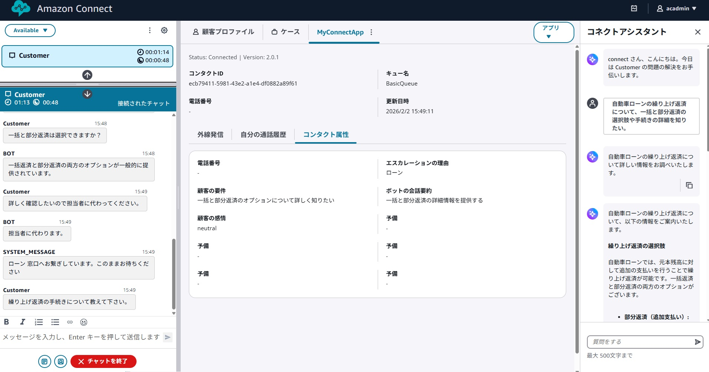
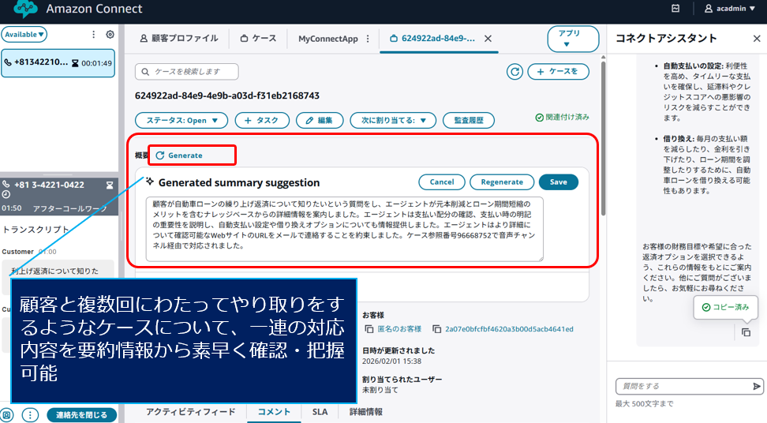
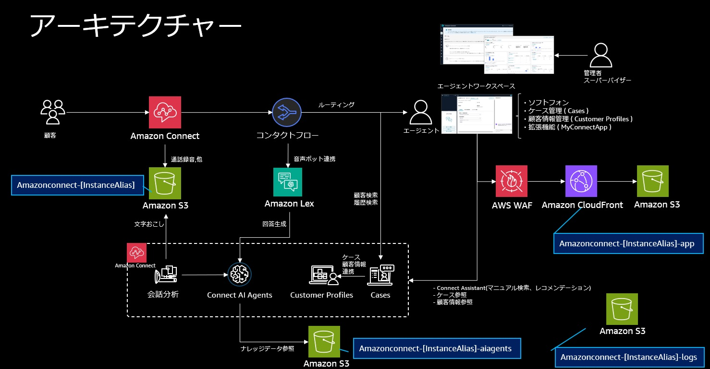

# sample-amazon-connect-smb-starter-kit-japan

## お知らせ
※ us-east-1/ap-northeast-1 の両方でデプロイ可能になりました。

## バージョン情報
**v2.0.1** (2026年2月)

## 更新情報
2026年2月
- 更新内容
  - **AI Agents に対応**: Q in Connect から AI Agents へ刷新し、オーケストレーションタイプの AI Agent/AI Prompt の日本版を提供
  - **エスカレーション機能の強化**: 会話型ボットからオペレータへのエスカレーション時に理由や要件を自動判定し、自律的に適切な窓口へ転送が可能に
  - **オペレータ画面の改善**: MyConnectApp(3rd Party App)の画面にボットとの会話要約やエスカレーション理由を自動表示
  - **Amazon Connect Cases 統合**: ケース要約機能を追加
  - **デプロイ手順の簡素化**: Cloudformation の見直しにより、ケーステンプレート、Amazon Lex、AWS WAFなどのデプロイを自動化
  - **マルチリージョン対応**: 東京(ap-northeast-1)、バージニア北部(us-east-1)からデプロイ先を選択可能
  - **マルチチャネル対応**: MyConnectApp が Voice,Chat の両チャネルに対応
  
2025年11月
- 更新内容
  - 「[**Amazon Connect が音声ボットとチャットボット向けの会話分析機能を提供開始**](https://aws.amazon.com/about-aws/whats-new/2025/11/amazon-connect-conversational-analytics/)」にあわせてコンタクトフロー内の会話分析を有効化したサンプルフローモジュールを提供
  - Amazon Connect Chat でもそのまま使用可能なサンプルフローを提供

2025年9月
- 初回リリース
- 内容一覧
  - Amazon Connect Customer Profiles と Amazon Connect Cases を使用した着信ポップアップと応対履歴管理
  - Amazon Connect Contact Lens による会話の文字おこし
  - Amazon Q in Connect によるエージェントアシスト機能の活用 (マニュアルサーチ)
  - Amazon Q in Connect による通話中のリアルタイムの回答提案の表示 (レコメンデーション)
  - Amazon Q in Connect による音声ボット (セルフサービス)、エージェントへのエスカレーション
  - 3rd Party App を統合したエージェントワークスペース
    - 発信者 ID 番号選択
    - 通話履歴表示
    - コンタクト属性表示
  - コンタクトフロー/祝日管理を含む各種テンプレート

## 目次
- [バージョン情報](#バージョン情報)
- [本パッケージについて](#本パッケージについて)
- [解決可能な課題](#解決可能な課題)
- [主要機能/特徴](#主要機能特徴)
- [アーキテクチャー](#アーキテクチャー)
- [導入ガイド](#導入ガイド)
- [サポートとフィードバック](#サポートとフィードバック)

## 本パッケージについて

- 本パッケージ(sample-amazon-connect-smb-starter-kit-japan)は、中小規模のコンタクトセンターを運営する企業向けに開発された、Amazon Connect の導入・デプロイを支援する統合ソリューションです。
- 本パッケージを導入することで、投資から価値創出までの時間を大幅に短縮し、ビジネスの成長を加速させることができます。シンプルな操作で高度な機能を実現し、効率的なコンタクトセンター運営を支援します。

## 解決可能な課題

- 従来、コンタクトセンターシステムの導入には、複数のツールの統合や技術的な専門知識が必要とされ、多大な時間とコストが発生していました。特に、AI 機能の導入や CRM 連携には高度な技術力だけでなく実装に必要な期間もかかるため、特に中小規模のユーザーにとって大きな負担となっていました。これらの課題に対し、Amazon Connect に備わった各機能を利用開始するために必要な事前設定も自動化することで、利用者は初期設定済みの環境をもとに、Amazon Connect の利用を開始できます。

## 主要機能/特徴

- Amazon Connect にはコンタクトセンター運営に必要な主要機能が多く備わっています。本パッケージの利用により、コールフローに関しては、直収、セルフサービス(Lex と AI Agents の統合)のフローテンプレートが提供されます。各テンプレートには、会話の文字おこしなど応対品質の向上に役立つ Contact Lens の初期設定や、2025年～2030年の祝日カレンダーが組み込まれています。さらに、事前設定済みの Customer Profiles と Cases は、顧客データと応対履歴の管理機能の利用をすぐに可能です。また、エージェントが利用するエージェントワークスペース(ソフトフォン)を拡張する 3rd Party App(発信者ID番号選択、通話履歴、コール情報表示など)や、Amazon Q in Connect(エージェントアシスト)の初期設定も含まれます。

### 画面イメージ

## アーキテクチャー

### 概要図

### 利用する AWS サービス
- Amazon Connect
- Amazon Lex
- AWS Lambda
- Amazon CloudFront
- AWS WAF
- Identity and Access Management (IAM)
- Amazon S3
- AWS CloudFormation

### デプロイされるリソース
- Amazon Connect: Amazon Connect インスタンスが新規にデプロイされます。オプションで既存の Amazon Connect インスタンスを使用することも可能です。
- Amazon S3: 以下の4つの S3 バケットが作成されます:
  - amazonconnect-[InstanceAliace]: Amazon Connect のストレージ用バケットです。通話録音ファイル等が格納されます。
  - amazonconnect-[InstanceAliace]-app: 本パッケージの構成ファイルが保存され、また、エージェントワークスペースの拡張機能(MyConnectApp)の Web アプリケーションソース一式を格納します。
  - amazonconnect-[InstanceAliace]-aiagents: Amazon Connect AI Agents が参照するナレッジソースの格納先となるバケットです。
  - amazonconnect-[InstanceAliace]-logs: S3 バケットのアクセスログ、Amazon CloudFront のアクセスログの格納先となるバケットです。
- Amazon CloudFront: エージェントワークスペースの拡張機能（MyConnectApp）を配信するための CDN として使用します。
- AWS WAF: CloudFront ディストリビューションに AWS WAF を統合し、Web アプリケーションを保護します。
- Amazon Lex: セルフサービスを提供するための音声ボットサービスです。Amazon Connect のコンタクトフローから連携され、ナレッジソース参照のため Amazon Q in Connect と連携します。
- AWS Lambda: サンプルコンタクトフローをデプロイするためのリソース参照用の AWS Lambda です。AWS CloudFormation によるデプロイ時のみ利用します。本パッケージの動作では利用しません。

## 導入ガイド

### 前提条件

- 前提知識
  - AWS マネジメントコンソールへログインし、基本的な画面操作ができる
  - Amazon Connect の管理コンソールへログインし、基本的な画面操作ができる

- 必要な権限
  - このパッケージをデプロイするには、以下の権限が必要です。
  - AWS管理ポリシー「AdministratorAccess」が付与されたIAMユーザー/ロール、もしくは同等の権限
    - Amazon Connect インスタンスの作成権限
    - AWS CloudFormation によるリソースのデプロイ権限
    - IAM ロールおよびポリシーの作成権限
    - Amazon S3 バケットの作成権限
    - Amazon CloudFront ディストリビューションの作成権限
    - AWS Lambda 関数の作成権限
    - AWS WAF の作成権限

- システム要件
  - 本パッケージの対応リージョンは 東京リージョン(ap-northeast-1)またはバージニア北部リージョン(us-east-1)です。

### デプロイ手順

上から順に進み、手順を実施してください。

1.  デプロイメントガイドをダウンロード:[**こちら**](docs/other_docs/AmazonConnectPackage_DeploymentGuide_20260201.pdf)
1.  パラメーターシートをダウンロード:[**こちら**](docs/other_docs/AmazonConnectPackage_ParameterSheet.xlsx)
1.  デプロイモジュールをダウンロード:[**こちら**](docs/other_docs/amazon-connect-project.zip)
1.  デプロイメントガイドに従い作業を実施
    - 作業の流れは以下の通りです。動作確認含めて約1.5時間かかる想定です。
    - 事前準備: パラメーターシートの作成			[15分]
    - ステップ1: 環境の初期構築 (CloudFormation)		[10分 (デプロイ待ちの約2分含む) ]    
    - ステップ2: 環境初期設定					[10分]
    - ステップ3: 各種リソース追加 (CloudFormation)		[15分 (デプロイ待ちの約10分含む)]
    - ステップ4: 環境の確認と追加設定				[20分]
    - 動作確認							[30分]

## 主な費用

### Amazon Connect
Amazon Connect Voice では、使用に関連して、音声サービスの料金と通信サービス (テレフォニーまたはウェブ通話) の料金の 2 つの料金が発生します。音声サービスの利用料は、1 秒単位 (最低 10 秒) で請求されます。着信通話および CCP(コンタクトコントロールパネル) からダイヤルする手動の発信通話についての Amazon Connect Voice サービスの使用量は、エンドカスタマーがサービスに接続された秒数によって決まります。

### Amazon Connect AI Agents
Amazon Connect AI Agents が送受信するチャットメッセージ 1 件につき 0.0015 USD で請求されます。同様に、Amazon Connect AI Agents を有効にした、通話時間 1 分につき 0.008 USD が請求され、最低 10 秒の請求要件があります。Amazon Connect AI Agents をコンタクトのセルフサービス部分に使用された場合、セルフサービスインタラクションの全期間分の料金が請求されます。Amazon Connect でのセルフサービスエクスペリエンスの構築や編集には料金はかかりませんが、Amazon Lex の使用分は別途請求されます。

### Amazon S3
ストレージコストは、FAQドキュメント、チャット記録、およびWebアセットに保存されているデータ量に基づいて決まります。例:米国東部のスタンダードストレージを使用して 50 TB のコンテンツを保存した場合、1 か月あたり 1 GB あたり 0.023 USD を支払うことになります。過去 12 か月間にアカウントを作成し、[AWS 無料利用枠](https://aws.amazon.com/jp/free/?p=ft&z=subnav&loc=1&refid=ft_card&all-free-tier.sort-by=item.additionalFields.SortRank&all-free-tier.sort-order=asc&awsf.Free+Tier+Types=*all&awsf.Free+Tier+Categories=categories%23storage&ams%23interactive-card-vertical%23pattern-data-339318104.filter=%257B%2522filters%2522%253A%255B%255D%257D
)の対象となる場合は、1 か月あたり 0.00 USD を支払うことになります。注: Amazon CloudFront は、静的なウェブページを使用してチャットとウェブ通話機能をデモンストレーションする目的でのみ使用されます。実稼働環境では、お客様はこの機能を既存のウェブサイトに実装します。

### その他の プライシングリソース
- [Amazon Connect Pricing Page](https://aws.amazon.com/jp/connect/pricing/)
- [AWS Optimization and Licensing Assessment](https://aws.amazon.com/jp/optimization-and-licensing-assessment/)

## サポートとフィードバック
- 本パッケージに関するフィードバックやご報告は、GitHub の Issues 機能をご利用ください。
- Issues 機能は、本リポジトリの 「Issues」タブにある「New Issues」ボタンから操作頂けます。
 
### 報告時のお願い
- バグ報告の場合は、以下の情報を含めていただけると幸いです：
  - 発生している問題の具体的な説明
  - 問題の再現手順
  - 実行環境（AWS リージョン、ブラウザの種類とバージョンなど）
  - エラーメッセージのスクリーンショット（該当する場合）

- 機能改善の提案の場合は、以下の情報を含めていただけると幸いです：
  - 提案する機能の概要
  - その機能が必要な背景や理由
  - 期待する効果

### 注意事項
- 個人情報や機密情報を含める際はご注意ください
- すべての Issue に対して即時の対応を保証するものではありません。また、個別の技術サポートは提供しておりませんので、ご了承ください。
